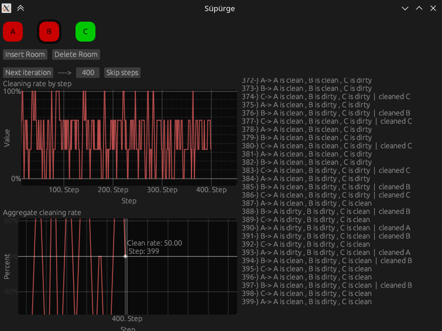

# Süpürge uygulaması

Süpürge uygulamasında yapılabilecekler:
- İstenildiği kadar oda eklenilip oda silinebilir.
- Bir sonraki adım geçiş yapılabilir.
    - Her adım geçişinde oda eğer pisse temizlenir.
    - temiz veya pis olmasına bakılmaksızın diğer odaya geçişinde rastgele temiz veya pis olarak atanır
- istenildiği kadar adım ileri atlatılabilir.
    - Bunu için **Skip Step** öncesine geçilmek istenen adım sayısı yazılıp atlanabilir
- Grafiklerden bazı çıkarımlar yapılabilir.
    - **Cleaning rate by step** -> her durumdaki odaların toplam temiz ve pis oda sayısının yüzdelik oranını veriyor.
    - **Aggregate cleaning rate** -> Tüm sistemin sürekli olarak temiz ve pis oda sayısı toplanıp tüm durumların temiz ve pis yüzdelik oranını veriyor.
- Grafiklerin üzerine geldiğinizde size o anki değerin detaylarını alabilirsiniz
- Sağ tarafta gösterilen geçmiş kısmında 
    - her adımdaki durumları gösteren,
    - hangi adımda olduğunu gösteren,
    - eğer temizlik olduysa bunu hangi odada yaptığını gösteren, bir geçmiş listesi bulunmaktadır.